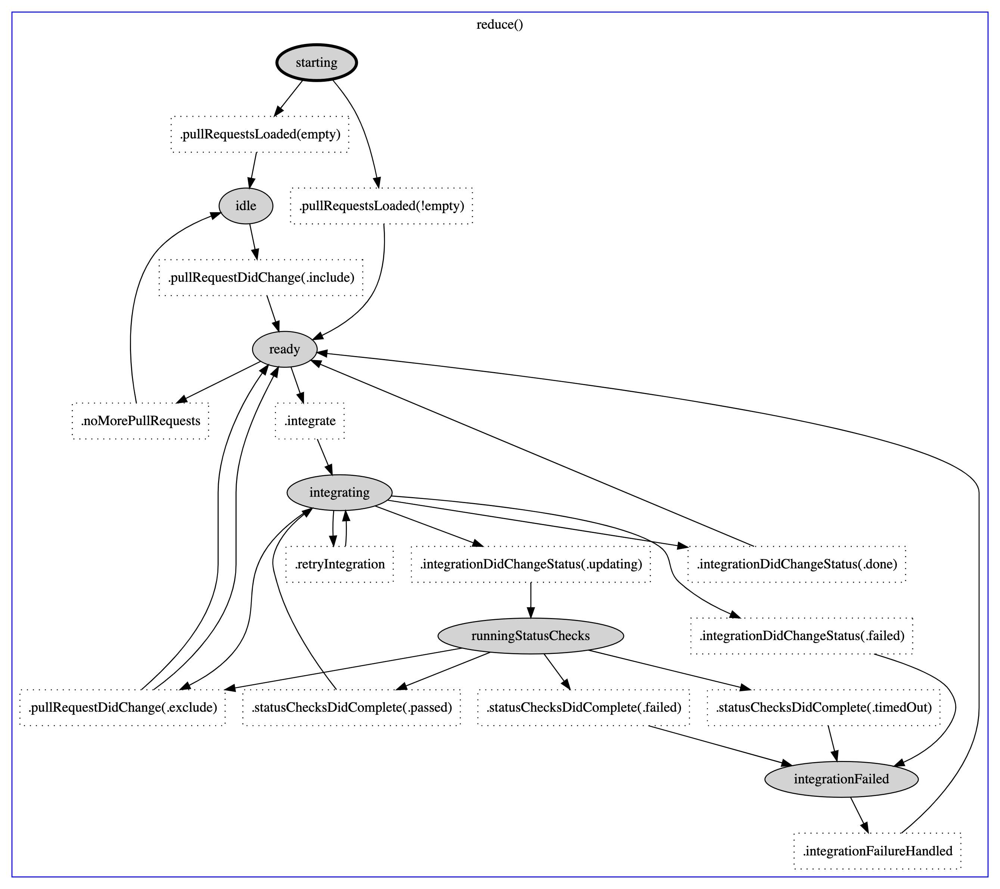
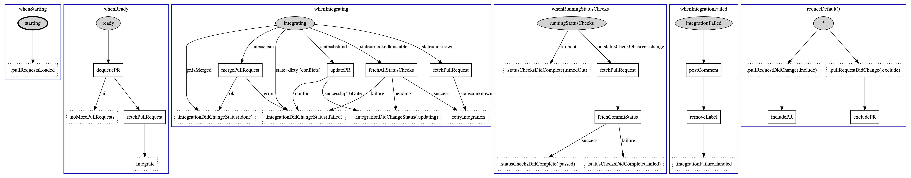

# Wall-E

A bot that monitors and manages your pull requests by ensuring they are merged when they're ready and don't stack up in your repository 🤓

## Motivation

Pull Requests are conceptually asynchronous and they go through a series of iterations until they are finally ready to be merged which not always happens when we are expecting, we can be waiting for CI to test it, waiting for a review, ... 

That can lead to the pull request staying in the repository for longer than it needs to be and potentially stacking up with other pull requests making the integrations more time consuming and challenging.

## The notion of ready

Pull Requests should meet a specific set of criteria before being merged.

- Be in sync with the base branch
- Be reviewed and approved by a minimum number of reviewers
- Have all checks passing

Depending on the workflow of each team some of them may be disabled to suit their needs.

## How the bot works

Wall-E is a bot written in Swift using Vapor.

It works by listening to the GitHub webhook to know when labels are being added/removed and when Status Checks are updated on PRs

### Detection of the Merge Label

When a specific label – configurable via the `MERGE_LABEL` environment variable – is added to your Pull Requests, Wall-E will:

 - Add that PR to a queue dedicated to the branch this PR is targeting
 - Post a comment in the PR to let you know that the PR has been queued and its position in the queue

(†) Wall-E handles one merge queue per target branch to allow PRs targeting different branches to be merged in parallel.

### Integration of a PR

When the bot dequeues the top PR from a queue, it will start its integration, which consists of the following steps:

 - Merge the target branch back into the PR to ensure it's up-to-date if not
 - Wait for its status checks to pass
    - you can configure if you want the bot to only merge if _all_ statuses are green or only the _required_ ones via the `REQUIRES_ALL_STATUS_CHECKS` environment variable
 - Once the PR is deemed ready (status checks pass, green on GitHub with the minimal number of approvals reached), it will merge the PR into the target branch (squash)
 - Then it will go to the next PR in the queue

If there is a failure at some point during the integration of the PR – e.g. one of the (required) status check fails:

 - the bot will post a comment with the error on the PR
 - then it will remove the merge label
 - and go to the next PR in the queue

If you remove the merge label from a PR that was in the queue, that PR gets removed from the queue.

### Top Priority PRs

The bot also supports "Top Priority Labels" (configurable via the `TOP_PRIORITY_LABELS` environment variable)

When you add one of those "Top Priority" labels to your PR, the bot will ensure that this PR will be merged before any non-TP PRs targeting the same branch, by making that PR jump at the front of all the other non-top-priority PRs in the queue.

For example, if your queue already contains PRs `A`,`B`,`C`,`D`,`E` with `A` and `B` already marked with one of the Top Priority label, then adding a Top Priority label to the PR `E` will make it jump in front of `C` and `D` but still after `A` and `B`, so the queue will become `A`,`B`,`E`,`C`,`D`.

## Configuration

The bot is mainly configured via environment variables. Here are the main ones that you are at least required or recommended to provide to be able to start using this bot:

Env Var | Description
---|---
`GITHUB_ORGANIZATION` `GITHUB_REPOSITORY` | The GitHub organisation and repo name this bot will watch
`GITHUB_TOKEN` | The OAuth token to use for calls to the GitHub API
`GITHUB_WEBHOOK_SECRET` | The webhook secret to use to validate webhook payloads
`MERGE_LABEL` | The name of the label to use to add a PR to the queue
`TOP_PRIORITY_LABELS` | The name of the labels to use to mark as PR as top-priority – separate multiple label names by a comma
`REQUIRES_ALL_STATUS_CHECKS` | Defines if the bot should require _all_ status checks to be green before allowing to merge a PR, or only the ones configured as _required_ in GitHub settings (the default)

Some other environment variables allow further configuration of the bot, like values vor various timeouts; for the list of them all, see [`Sources/App/Extensions/EnvironmentProperties.swift`](https://github.com/babylonhealth/Wall-E/blob/master/Sources/App/Extensions/EnvironmentProperties.swift).

## Implementation details

The whole codebase is implemented in Swift using [Vapor](https://vapor.codes/).

💡 _You can use the `vapor xcode` command to generate an `xcodeproj` project and edit the code from there._

If you need to maintain/improve the code, here are some high-level implementation details that might help you navigate the codebase.

### MergeService

`MergeService` is a service class representing a single merge queue.

 - It handles the logic of the state machine for the various states and transitions to process each Pull Request in its queue in order
 - It is implemented using [ReactiveFeedback](https://github.com/babylonhealth/ReactiveFeedback)

Below are some diagrams to help you visualise the ReactiveFeedback state machine logic implemented in `MergeService`:

🔃 State Diagram

▶️ Action/Feedbacks Diagrams

### DispatchService

`DispatchService` is responsible for managing multiple `MergeService` instances, one per target queue.

 - The `DispatchService` single instance is the one receiving the events from the webhook, and will dispatch them to the right instance of `MergeService` associated with the target queue of the event's PR
 - If such a `MergeService` instance doesn't exist yet for that target branch, it will instantiate one.
 - Idle `MergeService` instances are cleaned up after a delay of inactivity – configurable via the `IDLE_BRANCH_QUEUE_CLEANUP_DELAY` environment variable – to free up the memory

### Other

The rest of the code is mainly API calls (in `API/`) and objects modelling the API data (`Models/`)

## Client app (Menu Icon)

This repository also comes with a Client app that allows you to quickly check the state of the Merge Bot queue from the menu bar.

To install the client app:

 - Build `WallEView/WallEView.xcodeproj` in Xcode and copy the app from build products directory to your applications directory, or download the app attached to the [latest GitHub release](https://github.com/babylonhealth/Wall-E/releases)
 - Run `defaults write com.babylonhealth.WallEView Host <application address>` to set the url to the app
 - Launch the app and enjoy.

 Once the app has been launched, a new icon should appear in your menubar.
 
 When opening the menu item by clicking on its icon, you can select a branch to see its associated merge queue.
 
 To kill the app and remove the menubar icon, right-click on the icon and select "Close".

Iconography © https://dribbble.com/shots/2772860-WALL-E-Movie-Icons

## Debugging

Using [the ngrok tool](https://dashboard.ngrok.com/get-started) you can run the app locally and still get all incoming events from GitHub webhooks.

- setup ngrok and start it, it will print out the public address from which all requests will be redirected to your localhost, i.e. https://randomnumber.ngrok.io

- add a webhook to the repository where you want to test the app (https://github.com/babylonhealth/walle-debug for use by Babylon team members):
 - set webhook url to https://randomnumber.ngrok.io/github
 - set content type to `application/json`
 - set a webhook secret to some random value
 - enabled status and pull request events

Then you can start the app locally setting its environment variables to point to the testing repository. You need to set `GITHUB_WEBHOOK_SECRET`, `GITHUB_TOKEN`, `GITHUB_ORGANIZATION` and `GITHUB_REPOSITORY` as environment variables in the `Run` scheme. You also need to set few other environment variables: `MERGE_LABEL` and `TOP_PRIORITY_LABELS`
